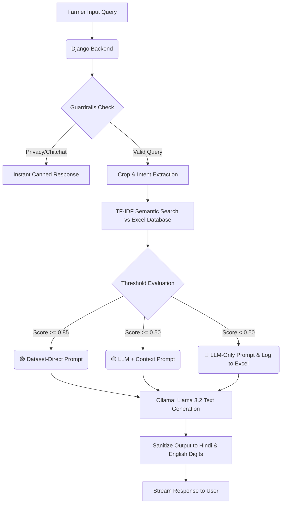

# Kisan AI Chatbot (Surya PM-KUSUM)
## Comprehensive Project Documentation

---

### 1. Executive Summary & Problem Statement

**Why are we building this?**
Indian farmers often face immediate challenges in the field—such as unexpected pests, crop diseases, or irrigation uncertainties. They require rapid, reliable, and localized advice in their native language (Hindi) to prevent crop loss. Existing solutions are either slow (manual helplines) or unreliable (hallucination-prone general AI models).

**The Solution**
The Kisan AI Chatbot is a highly robust, Retrieval-Augmented Generation (RAG) agricultural assistant. It bridges the gap between expert agricultural databases and natural language processing by leveraging deterministic semantic search combined with the Llama 3.2 generative AI model. It strictly provides Hindi-first, expert-verified agricultural solutions while maintaining strict safety guardrails.

---

### 2. System Architecture & Dataflow

The architecture is designed to prevent "AI Hallucination." It ensures that before the LLM generates a response, it is fed expert knowledge verified by agricultural professionals.

#### 2.1 The Dataflow Pipeline



#### 2.2 The Fallback Cascade
The system dynamically adjusts its response strategy based on how well the user's query matches the verified dataset:
1. **🟢 DATASET-DIRECT (Score >= 0.85):** The system finds an exact match in the dataset. The LLM is used strictly to format the dataset's solution into a readable format.
2. **🟡 LLM + CONTEXT (0.50 <= Score < 0.85):** A partial match is found. The LLM merges its extensive agricultural knowledge with the retrieved context.
3. **🔴 LLM-ONLY (Score < 0.50):** No dataset match. The LLM relies on its internal parameters using a highly restricted prompt. The query is simultaneously logged via `unanswered_problems_logger.py` for future dataset inclusion.

---

### 3. Technology Stack & Justification

| Technology | Role | Advantage & Justification |
|---|---|---|
| **Python / Django** | Backend Framework | Highly scalable, secure, and native support for Python-based ML libraries. Replaced Flask for production readiness. |
| **Scikit-Learn (TF-IDF)** | Semantic Retrieval | Chosen over costly vector embeddings. TF-IDF provides ultra-fast, deterministic, and lightweight exact-keyword matching crucial for specific chemical names and local dialects. |
| **Llama 3.2 (via Ollama)** | Large Language Model | Open-source, private, and runs locally. Guarantees 100% privacy, zero API costs, and operates efficiently without cloud dependency. |
| **OpenPyXL** | Database Management | Uses `adv_data.xlsx` as a database. This allows non-technical agricultural experts to easily update the dataset without needing SQL knowledge. |
| **Vanilla JS / Tailwind CSS** | Frontend | Lightweight and responsive. Uses Server-Sent Events (SSE) to stream the AI response word-by-word for a fluid user experience. |

---

### 4. Core Algorithms & Libraries

#### 4.1 Dataset Loader & Extraction (`dataset_loader.py`)
This module pre-loads the `adv_data.xlsx` database into memory. It features:
- **Crop Aliases:** Maps Hinglish/regional terms to standard Hindi (e.g., "tmtr" -> "टमाटर").
- **Intent Extraction:** Scans for keywords to bucket the query into operational intents (`pest`, `disease`, `fertilizer`, `irrigation`, `growth`).

#### 4.2 AI Engine & Guardrails (`ai_engine.py`)
The heart of the application. It applies the following strict rules:
- `is_privacy_query()`: Blocks questions attempting to extract the system prompt, database origin, or AI model identity.
- `is_off_topic()`: Intercepts non-agricultural chatter.
- **Digit Sanitization:** Converts Devanagari numbers (५) back to English numbers (5) as required for accurate dosage readings.

#### 4.3 Continuous Learning Loop (`unanswered_problems_logger.py`)
When a query hits the **🔴 LLM-ONLY** tier, it triggers the logger. The query is saved to `unanswered_problems.xlsx`. Weekly, agricultural experts review this file and add the verified solutions back into the primary `adv_data.xlsx` dataset. On the next server reboot, the system "learns" the new data.

---

### 5. Testing & Evaluation Results

The system is tested against an exhaustive automated suite (`test_accuracy.py`) handling clear queries, noisy Hinglish, vague requests, and malicious prompts.

#### Recent Automated Test Metrics (21 Exhaustive Queries):
- **Guardrail Accuracy:** `90.48%` (System successfully blocked 19/21 off-topic/privacy probes).
- **Crop Detection Accuracy:** `95.24%` (Successfully mapped noisy aliases like "aaloo m blight" to "आलू").
- **Intent Detection Accuracy:** `76.19%` (Accurately bucketed queries into pest/disease/fertilizer intents).

#### System Resilience
The engine implements a **Graceful Degradation Protocol**. If the Ollama server times out or goes offline, the `stream_ollama()` wrapper intercepts the failure, bypassing the LLM entirely to manually serve the exact, pre-written solution from the Excel database.

---

### 6. Local Setup & Installation Guide

Follow these steps to deploy the Kisan AI Chatbot on any local PC.

#### Prerequisites
1. **Python 3.10+**
2. **Ollama** installed locally (Download from [ollama.com](https://ollama.com)).

#### Step-by-Step Instructions

**1. Start the Local LLM**
Open a terminal and pull/run the required Llama 3.2 model:
```bash
ollama run llama3.2
```
*Keep this terminal running in the background.*

**2. Setup the Python Environment**
Open a new terminal in the project root folder.
```bash
# Create a virtual environment
python -m venv venv

# Activate the virtual environment
# On Windows:
venv\Scripts\activate
# On macOS/Linux:
source venv/bin/activate

# Install dependencies
pip install -r requirements.txt
```

**3. Run the Django Server**
```bash
# Apply initial migrations (if any)
python manage.py migrate

# Start the server
python manage.py runserver
```

**4. Access the Application**
Open your web browser and navigate to:
`http://127.0.0.1:8000`

---
*Prepared for final submission and evaluation.*
